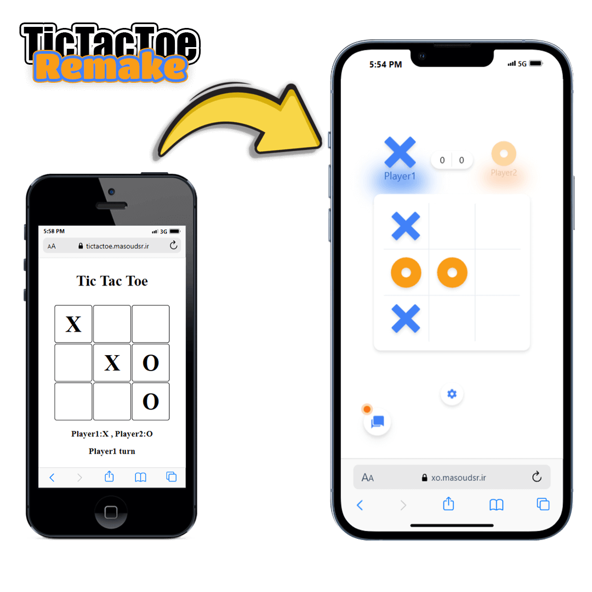

🎮 XO: TicTacToe Remake 
This is a remake of the classic TicTacToe game I previously developed. Now with enhanced features, a more modern design, and added functionality like AI opponent and online gameplay!

You can check out the original version of the game here: 
Play the original game:🌐<a href="https://tictactoe.masoudsr.ir/">tictactoe.masoudsr.ir/</a> 
View the original game source code:[github.com/MasoudSR/tictactoe](https://github.com/MasoudSR/tictactoe)

Features: 
🤖 Play against AI: Challenge yourself with different levels of AI difficulty. 
👥 2-Player Matches: Play with your friends either offline or online. 
💬 In-game Chat: Communicate with your friend while playing online.

Demo: 
Play the remake here: 🌐[xo.masoudsr.ir](https://xo.masoudsr.ir/)

Technologies Used: 
React.js: For building the user interface. 
TailwindCSS: For responsive and modern design. 
PeerJS: For enabling real-time peer-to-peer online matches
